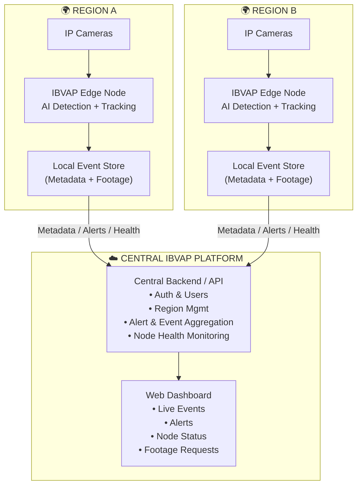
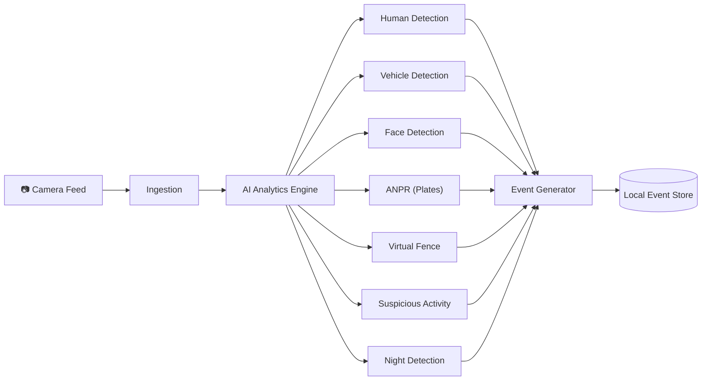
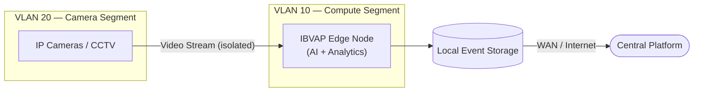
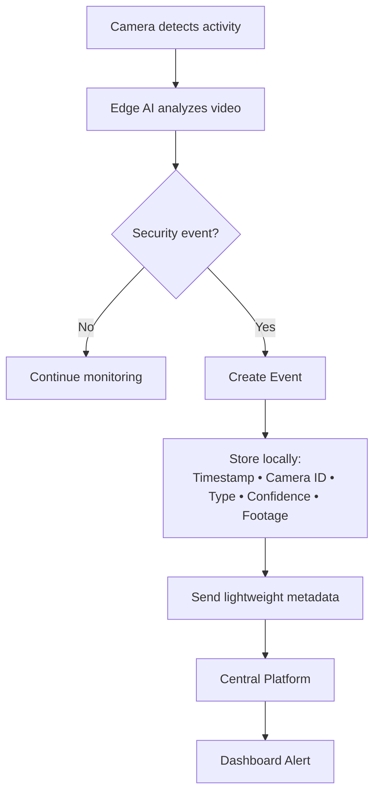
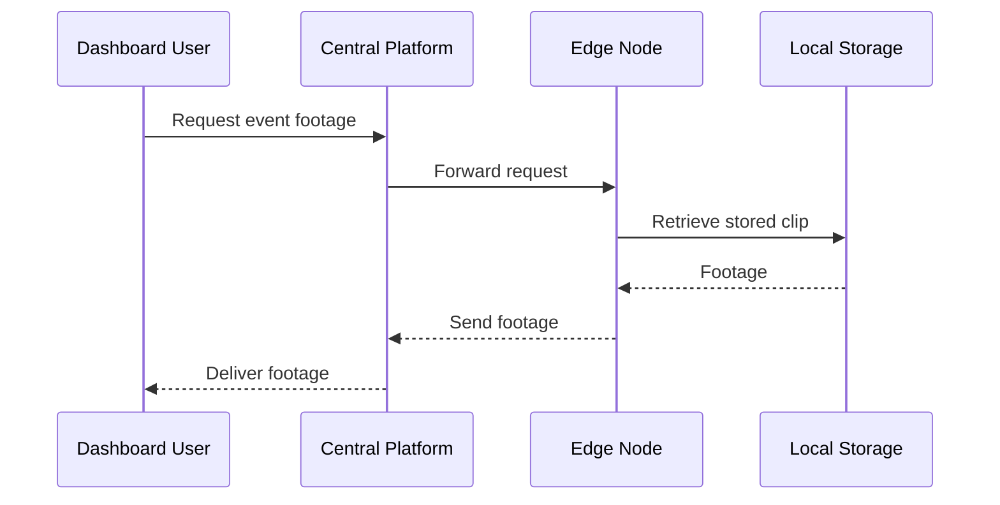
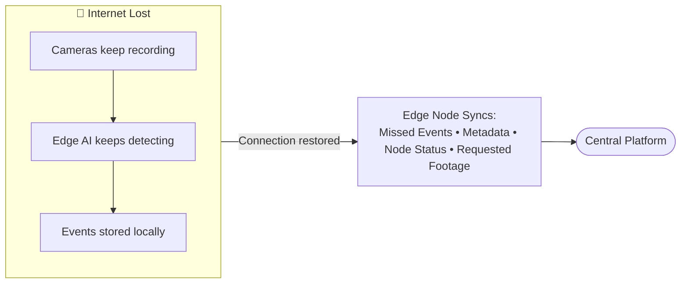
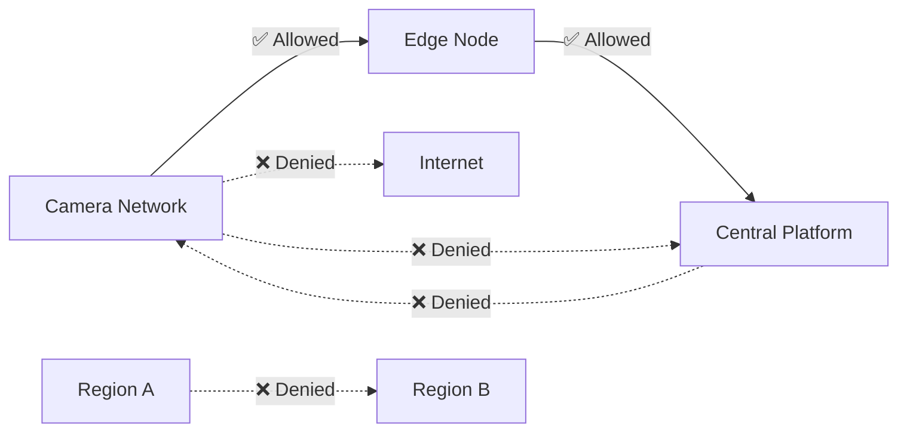
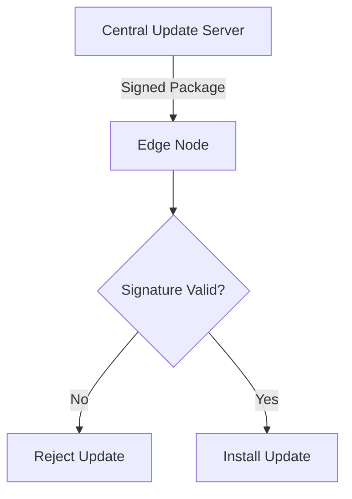
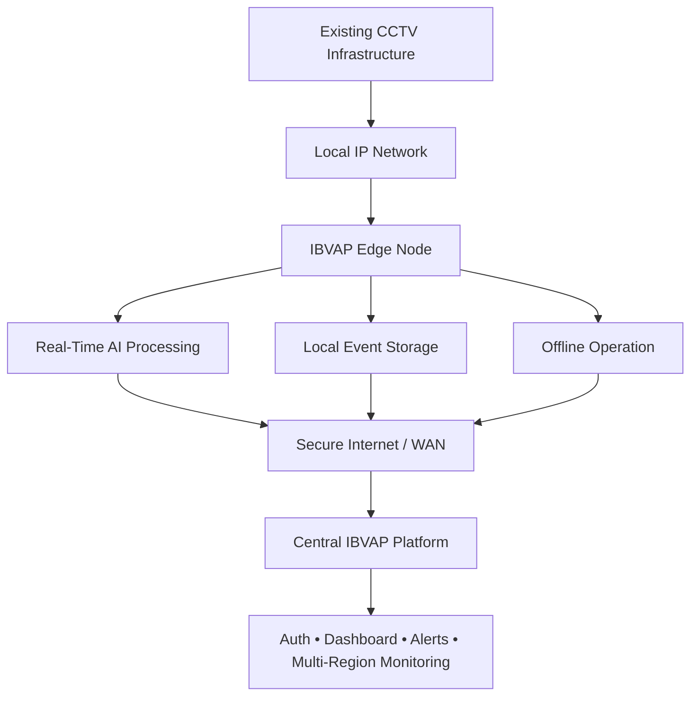

# Requirements

- Human detection and tracking
- Vehicle detection and classification
- Face detection
- Automatic Number Plate Recognition (ANPR)
- Virtual fence intrusion detection
- Suspicious activity detection
- Night-time movement detection
- Real-time alert generation and event logging
- Expected Solution The proposed system should leverage Artificial Intelligence, Machine Learning, Computer Vision, and Video Analytics to create a software-defined surveillance platform capable of extracting actionable intelligence from existing CCTV infrastructure.

# The Solution Must

- Eliminate dependence on expensive dedicated surveillance hardware.
- Enable intelligent monitoring through AI-powered video analytics.
- Provide real-time alerts for security incidents and border intrusions.
- Support facial recognition, vehicle identification, and behavioral analytics through software.
- Authorised person database...
- Human officer verification...
- virtual Boundary/ fence...
- Improve situational awareness and response time for border security forces.
- Support integration with existing command and control systems.
- The final solution should be cost-effective, scalable, and suitable for deployment across remote border locations and strategic installations.
- Possible Project Name IBVAP – Intelligent Border Video Analytics Platform

## ANPR

- Manage whitelisting, blacklisting, and watchlist, frequently observed and unknown vehicles.

# IBVAP — Intelligent Border Video Analytics Platform

### System Architecture (Redesigned for Clarity)

> **Core principle:** *Process locally. Detect locally. Store locally. Synchronize centrally.*

---

## 1. One-Line Summary

Every border region runs its own **Edge Node** that watches its cameras, detects events with AI, and stores footage locally. Only lightweight metadata, alerts, and health pings travel to the **Central Platform** — full video never leaves the region unless someone specifically requests it.

---

## 2. High-Level System Overview

**Key idea:** the Central Platform is a *thin coordinator*, not a video pipe. Each region is self-sufficient.

---

## 3. What Each Edge Node Does

| Function | Purpose |
| --- | --- |
| Human / Vehicle Detection | Identify people & vehicles crossing camera view |
| Face Detection | Flag and log faces for review |
| ANPR | Read vehicle number plates automatically |
| Virtual Fence | Trigger alert when a defined boundary line is crossed |
| Suspicious Activity | Behavioral pattern flags (loitering, climbing, etc.) |
| Night Detection | Low-light / IR-based detection mode |

---

## 4. Regional Network Layout

Cameras live on an **isolated VLAN** — they can only talk to the Edge Node, never directly to the internet or the Central Platform.

---

## 5. Event Lifecycle

---

## 6. Footage Retrieval (On-Demand Only)

Continuous video **never** streams to the center — only the specific clip requested, and only when authorized.

---

## 7. Offline Resilience

| While offline | Status |
| --- | --- |
| Cameras recording | ✅ Continues |
| AI detection | ✅ Continues |
| Event storage | ✅ Continues |
| Central sync | ⏸ Paused (auto-resumes) |

---

## 8. Security Model — Who Can Talk to Whom

The **Edge Node is the only gatekeeper** between raw surveillance infrastructure and the outside world. No direct region-to-region access exists.

---

## 9. Secure Software Updates

---

## 10. Prototype Demo vs. Real Deployment

| Stage | 🧪 Prototype Demo | 🏗️ Real Deployment |
| --- | --- | --- |
| Camera | Smartphone camera | Fixed IP CCTV camera |
| Network | Local Wi-Fi hotspot | Segmented VLAN CCTV network |
| Edge Node | Laptop running IBVAP software | Dedicated Edge processing server |
| Uplink | Internet (Wi-Fi/mobile) | Secure WAN / Internet |
| Platform | Same hosted Central Platform | Same hosted Central Platform |

The software stack is **identical** in both cases — only the hardware at the edges changes. This is the key point to make in a presentation: *the same platform scales from a laptop demo to a real CCTV deployment without redesign.*

---

## 11. Final Summary Diagram

---

## 12. Presentation Talking Points

- The live demo validates real software behavior using **smartphones as IP cameras** and isolated Wi-Fi as simulated regions.
- The same architecture maps directly onto a **segmented IP CCTV network** in a real deployment.
- AI inference keeps running at the Edge Node **even without internet** — only central sync pauses.
- The Central Platform receives **metadata, alerts, health status, and requested footage only** — never continuous raw video.
