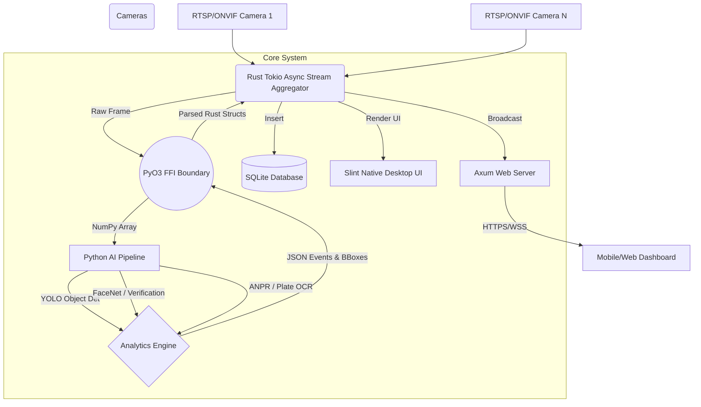

# IBVAP: Intelligent Border & Video Analytics Platform

## 1. High-Level Architecture Overview

IBVAP is a hybrid Edge AI application designed to provide **real-time AI-driven video surveillance** completely locally, without requiring internet access.

The system is built on a high-performance **Rust backend** responsible for concurrency, video stream orchestration, user interfaces (both Desktop and Web), and local database storage. The **AI Analytics Engine is built in Python**, executing heavy neural network inference tasks (YOLO object tracking, face recognition, ANPR, behavioral analytics).

Rust and Python are tightly coupled using **PyO3**, which allows the Rust backend to invoke Python classes and methods directly in the same memory space, completely eliminating the latency of inter-process communication (IPC) or HTTP overhead.

## 2. Tech Stack

### Core Runtime
- **Rust**: The primary application backbone. Handles all I/O, database interactions, web serving, and desktop UI rendering. Chosen for memory safety and zero-cost abstractions.
- **Python 3**: The AI worker runtime. Executes the ML pipeline.
- **PyO3**: The bridge connecting Rust and Python, allowing Rust to execute Python scripts as native threads.

### Artificial Intelligence & Computer Vision
- **OpenCV (Python & Rust)**: Frame capture, decoding, and drawing.
- **Ultralytics YOLO**: Deep learning models for high-speed object detection and multi-object tracking (BoT-SORT / ByteTrack).
- **FaceNet / InsightFace**: Facial extraction, embeddings, and similarity verification.
- **Tesseract / EasyOCR**: Automated Number Plate Recognition (ANPR).
- **NumPy & SciPy**: Vector math and bounding box calculations.

### Backend Infrastructure
- **Tokio**: Rust's asynchronous runtime for handling concurrent camera streams, web requests, and background tasks.
- **SQLite (rusqlite)**: Embedded database for storing camera configurations, users, and event histories locally. No external database servers (like PostgreSQL or Redis) are required.
- **Axum**: Rust async web framework used to serve the Web Operator Dashboard and REST API.
- **Axum-Server (Rustls)**: Provides self-signed TLS (`HTTPS`) for secure local network access.

### User Interfaces
- **Slint UI**: A lightweight, GPU-accelerated declarative UI toolkit used for the native full-screen Desktop Command Center.
- **HTML5 / Vanilla CSS / Vanilla JS**: The Web Server dashboard stack. Designed to be ultra-fast, responsive for mobile and desktop, and zero-dependency (no React/Vue overhead).
- **WebSockets**: Facilitates real-time event pushing from the Axum backend to the Web UI.

## 3. Core Modules

### 3.1 `streaming.rs` (Rust)
The beating heart of the video processing loop. For each registered camera, it spawns a dedicated Tokio thread that continuously fetches frames, passes them across the PyO3 boundary to the AI pipeline, receives JSON formatted events, classifies them into `Alert` or `Info`, saves snapshots to the disk, updates the SQLite DB, and pushes notifications to both the Slint Desktop UI and the Axum Web Server.

### 3.2 `pipeline.py` (Python)
The master AI orchestrator. It receives raw images and orchestrates them through:
1. **Object Detection & Tracking**: Identifies people, vehicles, etc., and tracks them across frames.
2. **Behavioral Analytics**: Evaluates track trajectories to detect loitering, trespassing, sudden running, or wrong-way movement.
3. **Identity Verification**: Isolates faces, creates embeddings, and checks them against the known registry.
4. **ANPR**: Extracts and reads license plates of tracked vehicles.

### 3.3 `web_server.rs` (Rust)
Hosts a secure `HTTPS` server that serves the mobile-responsive dashboard. It uses a `tokio::sync::broadcast` channel to subscribe to alerts emitted by `streaming.rs` and forwards them instantly to connected web browsers via WebSockets (`wss://`).

### 3.4 Camera Management (`database.rs` & `ui/main.slint`)
Cameras are automatically discovered (ONVIF) or manually added. They can be toggled between **Restricted Mode** (strict border-control alerts) and **Public Mode** (routine monitoring, selective alerts). Credentials and configurations are stored securely in SQLite.
